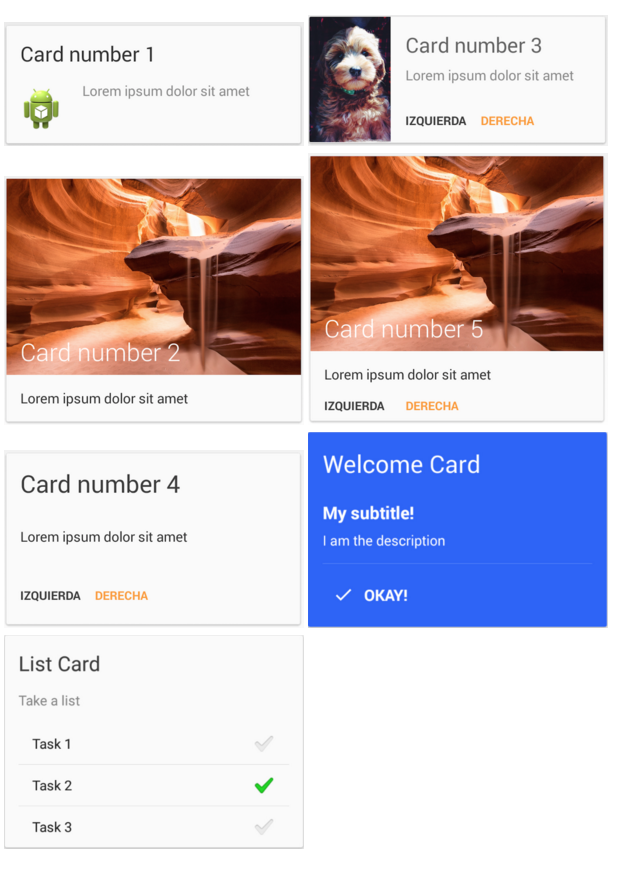

## MaterialList的使用
这个开源项目是在一个RecyclerView控件中使用CardView卡片展示了Item
MaterialListView是这个开源项目的使用入口
### 如何简单实用
``` java
private MaterialListView mListView;
//给RecyclerView的Item添加动画效果
mListView = (MaterialListView) findViewById(R.id.material_listview);
mListView.setItemAnimator(new SlideInLeftAnimator());
mListView.getItemAnimator().setAddDuration(300);
mListView.getItemAnimator().setRemoveDuration(300);

//设置Adapter数据源为空时，展示的视图
final ImageView emptyView = (ImageView) findViewById(R.id.imageView);
emptyView.setScaleType(ImageView.ScaleType.CENTER_INSIDE);
mListView.setEmptyView(emptyView);

//设置Item滑动删除的回调事件
mListView.setOnDismissCallback(new OnDismissCallback() {
    @Override
    public void onDismiss(@NonNull Card card, int position) {
        // Show a toast
        Toast.makeText(mContext, "You have dismissed a " + card.getTag(), Toast.LENGTH_SHORT).show();
    }
});

//设置Item点击的回调时间
mListView.addOnItemTouchListener(new RecyclerItemClickListener.OnItemClickListener() {
    @Override
    public void onItemClick(@NonNull Card card, int position) {
        Log.d("CARD_TYPE", "" + card.getTag());
    }

    @Override
    public void onItemLongClick(@NonNull Card card, int position) {
        Log.d("LONG_CLICK", "" + card.getTag());
    }
});

//给适配器添加一个Card
mListView.getAdapter().addAll(new Card.Builder(this)
    .setTag("SMALL_IMAGE_CARD")
    .setDismissible()//可以左右滑动删除
    .withProvider(new CardProvider())
    //这个setLayout()方法中的ID会作为MaterialListAdapter中的getItemViewType()方法返回
    .setLayout(R.layout.material_small_image_card)
    .setTitle(title)//对应上面方法设置的layout.xml中id为R.id.title的TextView
    .setDescription(description)//对应上面方法设置的layout.xml中id为R.id.supportingText
    .setDrawable(R.drawable.sample_android)////对应上面方法设置的layout.xml中id为R.id.image
    .setDrawableConfiguration(new CardProvider.OnImageConfigListener() {
        @Override
        public void onImageConfigure(@NonNull final RequestCreator requestCreator) {
            requestCreator.rotate(position * 90.0f)
                    .resize(150, 150)
                    .centerCrop();
        }
    })
    //添加两个Button
    .addAction(R.id.left_text_button, new TextViewAction(this)
                        .setText("left")
                        .setTextResourceColor(R.color.black_button))
    .addAction(R.id.right_text_button, new TextViewAction(this)
            .setText("right")
            .setTextResourceColor(R.color.orange_button))
    .endConfig()
    .build();)
```
### 源码分析
现在来分析下流程：
- 初始化MaterialListView控件
```java
public MaterialListView(Context context, AttributeSet attrs, int defStyle) {
        super(context, attrs, defStyle);
        //shit,在这里设置的Adapter，我就说怎么没设置Adapter呢
        setAdapter(new MaterialListAdapter());

        //读取属性
        if (attrs != null) {
            //.....
        }
    }
```
- 调用mListView.getAdapter().addAll(Card)刷新数据
```java
//修改数据源mCardList
mCardList.add(position, card);
card.getProvider().addObserver(this);
mItemAnimation.onAddItem(position, scroll);
notifyItemInserted(position); // Triggers the animation!
```
- 调用Adapter中的onCreateViewHolder(ViewGroup parent, int viewType)
这个方法什么时候调用：Called when RecyclerView needs a new {@link ViewHolder} of the given type to representan item
所以我们不用担心性能问题。然我们继续看MaterialListAdapter中的这个方法实现
``` java
@Override
public ViewHolder onCreateViewHolder(final ViewGroup parent, final int viewType) {
    //这里的viewType这个变量是我们在前面通过new Card.Builder(this).setLayout()方法来设置的
    return new ViewHolder(LayoutInflater
            .from(parent.getContext())
            .inflate(viewType, parent, false));
}

@Override
public int getItemViewType(final int position) {
    return mCardList.get(position).getProvider().getLayout();
}

@Override
public void onBindViewHolder(final ViewHolder holder, final int position) {
    //关键代码
    holder.build(getCard(position));
}
```
- 看Holder的实现
```java
public static class ViewHolder extends RecyclerView.ViewHolder {
    private final CardLayout view;

    public ViewHolder(@NonNull final View v) {
        super(v);
        view = (CardLayout) v;
    }

    public void build(Card card) {
        view.build(card);
    }
}
```
- 看CardView.build实现
```java
public void build(@NonNull final Card card) {
    mCard = card;

    if (!mObserves) {
        mCard.getProvider().addObserver(this);
        mObserves = true;
    }

    mCard.getProvider().render(this, card);
}
```
- 看CardProvider.reder()方法实现
```java
//无脑的填充数据
@SuppressWarnings("unchecked")
public void render(@NonNull final View view, @NonNull final Card card) {
    // The card background
    final CardView cardView = findViewById(view, R.id.cardView, CardView.class);
    if (cardView != null) {
        cardView.setCardBackgroundColor(getBackgroundColor());
    }

    // Title
    final TextView title = findViewById(view, R.id.title, TextView.class);
    if (title != null) {
        title.setText(getTitle());
        title.setTextColor(getTitleColor());
        title.setGravity(getTitleGravity());
    }

    // Subtitle
    final TextView subtitle = findViewById(view, R.id.subtitle, TextView.class);
    if (subtitle != null) {
        subtitle.setText(getSubtitle());
        subtitle.setTextColor(getSubtitleColor());
        subtitle.setGravity(getSubtitleGravity());
        if (getSubtitle() == null || getSubtitle().isEmpty()) {
            subtitle.setVisibility(View.GONE);
        } else {
            subtitle.setVisibility(View.VISIBLE);
        }
    }

    // Description
    final TextView supportingText = findViewById(view, R.id.supportingText, TextView.class);
    if (supportingText != null) {
        supportingText.setText(getDescription());
        supportingText.setTextColor(getDescriptionColor());
        supportingText.setGravity(getDescriptionGravity());
    }

    // Image
    final ImageView imageView = findViewById(view, R.id.image, ImageView.class);
    if (imageView != null) {
        if (getDrawable() != null) {
            imageView.setImageDrawable(getDrawable());
        } else {
            final RequestCreator requestCreator = Picasso.with(getContext())
                    .load(getImageUrl());
            if (getOnImageConfigListenerListener() != null) {
                getOnImageConfigListenerListener().onImageConfigure(requestCreator);
            }
            requestCreator.into(imageView);
        }
    }

    // Divider
    final View divider = findViewById(view, R.id.divider, View.class);
    if (divider != null) {
        divider.setVisibility(isDividerVisible() ? View.VISIBLE : View.INVISIBLE);

        // After setting the visibility, we prepare the divider params
        // according to the preferences
        if (isDividerVisible()) {
            // If the divider has to be from side to side, the margin will be 0
            final ViewGroup.MarginLayoutParams params = (ViewGroup.MarginLayoutParams)
                    divider.getLayoutParams();
            if (isFullWidthDivider()) {
                params.setMargins(0, 0, 0, 0);
            } else {
                int dividerMarginPx = dpToPx(DIVIDER_MARGIN_DP);
                // Set the margin
                params.setMargins(
                        dividerMarginPx,
                        0,
                        dividerMarginPx,
                        0
                );
            }
        }
    }

    // Actions
    for (final Map.Entry<Integer, Action> entry : mActionMapping.entrySet()) {
        final View actionViewRaw = findViewById(view, entry.getKey(), View.class);
        if (actionViewRaw != null) {
            final Action action = entry.getValue();
            action.setProvider(this);
            action.onRender(actionViewRaw, card);
        }
    }
}
```
### 总结
开源项目里面给我提供了2种CardProvider，上面说的是一种，还有一种是ListCardProvider。所以当这两种类型不满足我们时，我们可以继承CardProvider去实现一个Provider，在reder()这个方法里面把数据填充到我们自己的xml布局文件中
### 效果图

