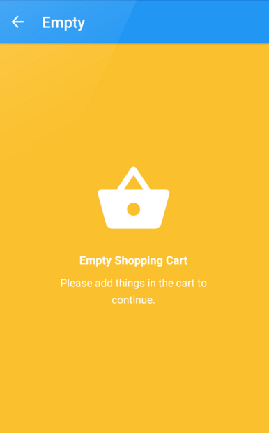

## stateLinearLayout和stateRelativeLayout的使用
这两个布局控件继集成了4种显示的View，当我们的界面中，若有几种状态，例如：正常时显示正常内容，当拉去数据为空时展示一种视图，当拉去失败时显示一种视图
- loading(正在加载中)
    - 调用showLoading()
- empty(数据为空)
    - 调用showEmpty(Drawable,Title,Content)
    
- error(加载失败)
    - 调用showError(Drawable,Title,Content,ButtonText,ClickListener)
    
- content(加载正常)
    - showContent()
    
